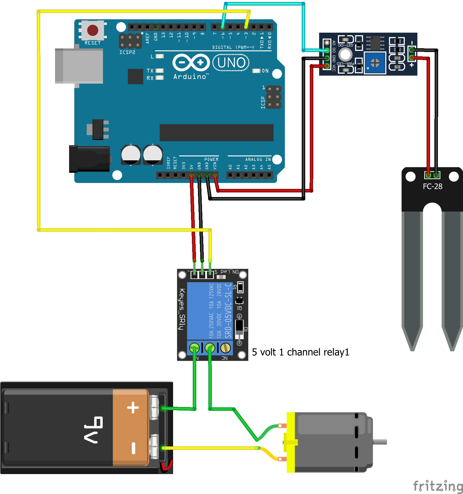

# Auto Plant Watering System

An automatic plant watering system using soil moisture sensors and a microcontroller (Arduino or Raspberry Pi).

## Features
- Automatically waters plants based on soil moisture
- Prevents overwatering
- Ideal for home gardens or indoor plants

## Components Used
- Soil Moisture Sensor
- Arduino Uno (or Raspberry Pi)
- Relay Module
- Water Pump
- Jumper wires and breadboard

## How It Works
The sensor checks the soil moisture. If it's dry, it activates the relay to start the pump, and stops it when enough moisture is detected.

## Circuit Diagram

## Code
See `code/main.ino`
